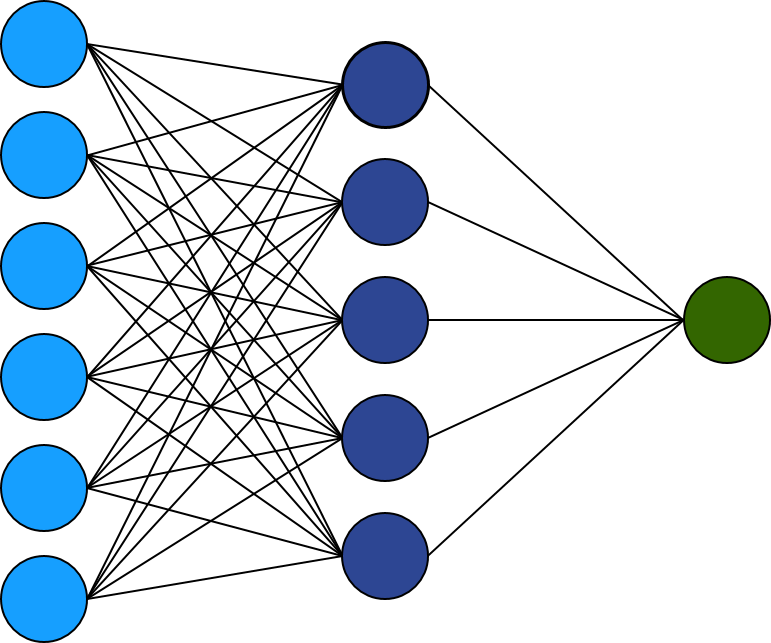
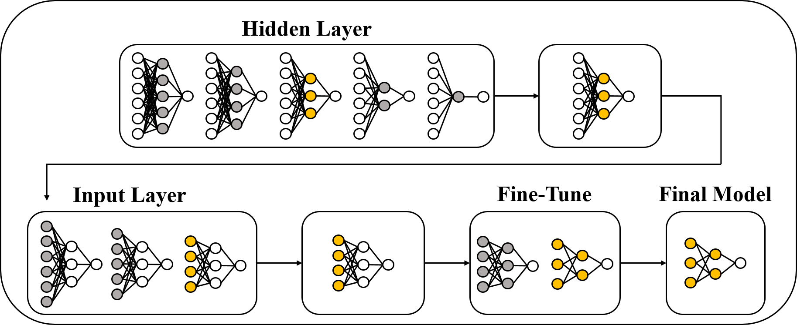

```{r, echo=FALSE, message=FALSE}
library(knitr)
library(fontawesome)
# the default output hook
hook_output <- knit_hooks$get('output')
knit_hooks$set(output = function(x, options) {
  if (!is.null(n <- options$out.lines)) {
    n <- as.numeric(n)
    x <- unlist(stringr::str_split(x, "\n"))
    nx <- length(x) 
    x <- x[pmin(n,nx)]
    if(min(n) > 1)  
      x <- c(paste(options$comment, "[...]"), x)
    if(max(n) < nx) 
      x <- c(x, paste(options$comment, "[...]"))
    x <- paste(c(x, "\n"), collapse = "\n")
  }
  hook_output(x, options)
    })
```

```{r analysis, include=FALSE, cache=TRUE}

# load packages -----------------------------------------------------------
library(ISLR2)
library(tidyverse)
library(selectnn)

# load data ---------------------------------------------------------------
data(Boston)

df <- Boston

# split into traning and test ---------------------------------------------
set.seed(6464371)
forTraining <- caret::createDataPartition(df$medv,
                                          p = 0.8)[[1]]
trainingSet <- df[forTraining,]
testSet <- df[-forTraining,]


# prep data --------------------------------------------------------

std <- caret::preProcess(trainingSet, method = 'range')
X_train <- as.matrix(predict(std, trainingSet))[, -ncol(df)]
X_test <- as.matrix(predict(std, testSet))[, -ncol(df)]

y_train <- as.matrix(predict(std, trainingSet))[, ncol(df)]
y_test <- as.matrix(predict(std, testSet))[, ncol(df)]

Boston = as.data.frame(cbind(X_train, y_train))

colnames(Boston)[13] <- 'medv'

Boston <- Boston[, -c(10)]

nn <- selectnn(medv ~ ., data = Boston, Q = 10, n_init = 10, maxit = 5000)

X <- nn$X
nn_nnet <- nnet::nnet(X, Boston$medv, Wts = nn$W_opt, size = nn$q,
                      trace = FALSE, linout = TRUE, maxit = 0) 

library(statnnet)
stnn <- statnnet(nn_nnet, X)  
summary(stnn)

```

class: title-slide, left, bottom

# `r rmarkdown::metadata$title`
----
## **`r rmarkdown::metadata$author`**, **`r rmarkdown::metadata$coauthor`**
### `r rmarkdown::metadata$institution`
#### `r rmarkdown::metadata$event`, `r rmarkdown::metadata$date`

---

# Feedforward Neural Networks 

.pull-left[ 
```{r, echo=FALSE, out.width="90%", out.height="110%", fig.align="center"}

``` 
]

<br>

<br>

--

$$
\begin{equation}
\text{NN}(x_i) = \gamma_0+\sum_{k=1}^q \gamma_k \phi \left( \sum_{j=0}^p \omega_{jk}x_{ji}\right)
\end{equation}
$$

---

# Data Application 

--

### Boston Housing Data (Kaggle)

506 communities in Boston, MA.   

--

 
Response: 

- `medv` (median value of owner-occupied homes)    

--

12 Explanatory Variables:  

- `rm` (average number of rooms per dwelling)  

- `lstat` (proportion of population that are disadvantaged)

---

# R Implementation: nnet

```{r nnet, echo = TRUE, eval = FALSE}
library(nnet)
nn <- nnet(medv ~ ., data = Boston, size = 8, maxit = 5000,
           linout = TRUE)
summary(nn)
```

--

```{r nnetmodel, eval = TRUE, echo = FALSE}
library(nnet)
set.seed(1010101)
nnet_model <- nnet(medv ~ ., data = Boston, size = 8, maxit = 5000,
                   linout = TRUE, trace = FALSE)
cat(c(capture.output(summary(nnet_model))[c(1:10)], "[...]"),
    sep = "\n") 
```


---

# Statistical Perspective

--

$$
y_i = \text{NN}(x_i) + \varepsilon_i, 
$$

--

where

$$
\varepsilon_i \sim N(0, \sigma^2)
$$

<br>

--

$$
\ell(\theta)= -\frac{n}{2}\log(2\pi\sigma^2)-\frac{1}{2\sigma^2}\sum_{i=1}^n(y_i-\text{NN}(x_i))^2
$$

---

# Uncertainty Quantification

Then, as $n \to \infty$

$$
\hat{\theta} \sim N[\theta, \Sigma = \mathcal{I}(\theta)^{-1}]
$$

--

Estimate $\Sigma$ using

$$
\hat{\Sigma} = I_o(\hat{\theta})^{-1}
$$

--

<br>  

However, inverting $I_o(\hat{\theta})$ can be problematic in neural networks.
---

# Redundancy

Redundant hidden nodes can lead to issues of unidentifiability for some of the parameters (Fukumizu 1996).

<br>

--

Redundant hidden nodes $\implies$ Singular information matrix.

<br>

--

Model selection is required.


---


# Model Selection

--

```{r, echo=FALSE, out.width="90%", fig.align="center"}

``` 

--

A Statistically-Based Approach to Feedforward Neural Network Model Selection (arXiv:2207.04248)

---


# Hypothesis Testing


.pull-left[
```{r, echo=FALSE, out.width="100%", fig.align="center"}
knitr::include_graphics("img/FNN1.png")
``` 
]

---
count: false
# Hypothesis Testing


.pull-left[
```{r, echo=FALSE, out.width="100%", fig.align="center"}
knitr::include_graphics("img/FNN2.png")
``` 
]

--

.pull-right[
  Wald test:
  
  {{content}}
  
  ]

--

$$
\begin{equation}
 \omega_j = (\omega_{j1},\omega_{j2},\dotsc,\omega_{jq})^T
\end{equation}
$$
{{content}}

--

$$
\begin{equation}
 H_0: \omega_j = 0
\end{equation}
$$
{{content}}

--

$$
\begin{equation}
 (\hat{\omega}_{j} - \omega_j)^T\Sigma_{\hat{\omega}_{j}}^{-1}(\hat{\omega}_{j} - \omega_j) \sim \chi^2_q
\end{equation}
$$
{{content}}


<!-- --- -->

<!-- # Covariate-Effect Plots -->

<!-- Propose covariate-effect plots of the following form: -->

<!-- -- -->

<!-- $$ -->
<!-- \begin{equation} -->
<!--  \hat{\beta}_j(x) = \frac{1}{n}\sum_{i=1}^n \left[ g(x + \sigma_{j}, X \setminus x_{ij}) - g(x, X \setminus x_{ij}) \right] -->
<!-- \end{equation} -->
<!-- $$ -->

<!-- -- -->

<!-- And their associated uncertainty: -->

<!-- -- -->

<!-- $$ -->
<!-- \begin{equation} -->
<!--   \hat{\beta}_j(x) \sim N[\beta_j(x), \nabla_\theta^T \beta_j(x) ~ \Sigma ~ \nabla_\theta \beta_j(x)] -->
<!-- \end{equation} -->
<!-- $$ -->


---

# Covariate-Effect Plots


$$
\begin{equation}
 \overline{\text{NN}}_j(x) = \frac{1}{n}\sum_{i=1}^n \text{NN}(x_{i,1}, \ldots,x_{i,j-1},x, x_{i,j+1}, \ldots)
\end{equation}
$$

--
Propose covariate-effect plots of the following form:

--

$$
\begin{equation}
 \hat{\beta}_j(x,d) = \overline{\text{NN}}_j(x + d) - \overline{\text{NN}}_j(x)
\end{equation}
$$

--

Usually set $d = \text{SD}(x_j)$

--

Associated uncertainty via delta method.


---


# R Implementation

.left-column[ 
<br>
```{r, echo=FALSE, out.width="80%", fig.align="center"}
knitr::include_graphics("img/statnnet.png")
``` 
]

--

.right-column[
<br>
<br>
```{r, echo=TRUE, eval = FALSE}
# install.packages("devtools")
library(devtools)
install_github("andrew-mcinerney/statnnet")
``` 
]


---

# Data Application (Revistied)

### Boston Housing Data (Kaggle)

506 communities in Boston, MA.   

--

 
Response: 

- `medv` (median value of owner-occupied homes)    

--

12 Explanatory Variables:  

- `rm` (average number of rooms per dwelling)  

- `lstat` (proportion of population that are 'lower status')

---

# Boston Housing: Model Selection 


```{r selection, echo = TRUE, eval = FALSE}
library(statnnet)
nn <- selectnn(medv ~ ., data = Boston, Q = 10,
               n_init = 10, maxit = 5000)
summary(nn)
```

--

```{r summ, echo = FALSE, cache = TRUE}
cat(c(capture.output(summary(nn))[c(1:7, 10:11, 15, 19)], "[...]"), sep = "\n") 
```

---

# Boston Housing: Model Summary 


```{r stnn, message = FALSE, eval = FALSE, tidy = FALSE}
stnn <- statnnet(nn)  
summary(stnn)
```

--

```{r summst, echo = FALSE, cache = TRUE}
cat(c("[...]", capture.output(summary(stnn))[12:23]
      , "[...]"), sep = "\n")  
```

---

# Boston Housing: Covariate-Effect Plots 

```{r, eval = FALSE}
plot(stnn, conf_int = TRUE, method = "deltamethod",  which = c(4, 8))
```  

--

.pull-left[ 
```{r plot1, cache = TRUE, echo = FALSE, fig.height = 6}
par(mar=c(5,6,4,2)+.1)
plot(stnn, conf_int = TRUE, method = "deltamethod", x_axis_r = c(0, 1), 
       which = 4, cex.caption = 2, cex.lab = 1.75, cex.axis = 1.5, caption = "")
# axis(1, c(0, 0.2, 0.4, 0.6, 0.8, 1), labels = 3.5:8.5, pos = -0.035)
axis(3, seq(0, 1, length.out = 5), labels = seq(3.5, 8.5, length.out = 5))
```  
]  

--

.pull-right[ 
```{r plot2, cache = TRUE, echo = FALSE, fig.height = 6}
par(mar=c(5,6,4,2)+.1)
plot(stnn, conf_int = TRUE, method = "deltamethod", x_axis_r = c(0, 1), 
     which = 8, cex.caption = 2, cex.lab = 1.75, cex.axis = 1.5, caption = "")
# axis(1, seq(0, 1, length.out = 5), labels = seq(2, 38, length.out = 5),
#      pos = -0.155)
axis(3, seq(0, 1, length.out = 5), labels = seq(2, 38, length.out = 5))
```  
] 

---
class: final-slide
# Summary 


Feedforward neural networks are non-linear regression models.  

--

Calculation of a likelihood function allows for uncertainty quantification.

--

Our R package extends existing neural network packages
to allow for a more interpretable, statistically-based output.


---

class: final-slide
# References

Fukumizu, K. (1996).
A regularity condition of the information  
matrix of a multilayer perceptron network. Neural Networks,  
9(5):871–879. 

McInerney, A. and Burke, K. (2022).
A Statistically-Based Approach  
to Feedforward Neural Network Model Selection.
arXiv preprint arXiv:2207.04248.


### R Package  

```{r, eval = FALSE}
devtools::install_github("andrew-mcinerney/statnnet")
```

`r fa(name = "github", fill = "#007DBA")` <font size="5">andrew-mcinerney</font>   `r fa(name = "twitter", fill = "#007DBA")` <font size="5">@amcinerney_</font> `r fa(name = "envelope", fill = "#007DBA")` <font size="5">andrew.mcinerney@ul.ie</font>


